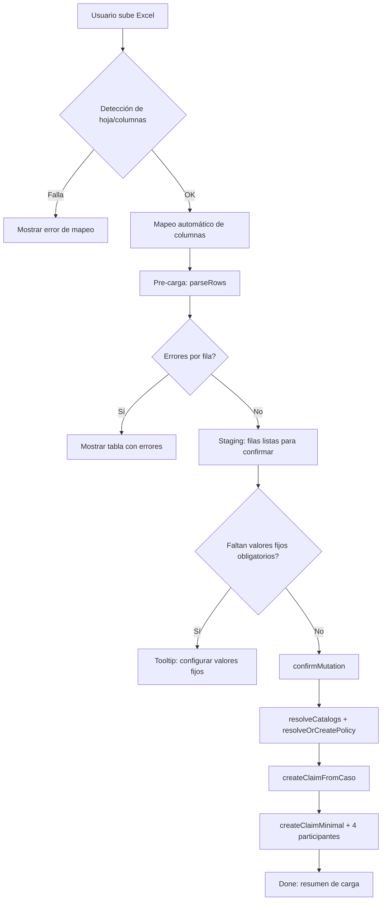

# Carga de Casos (`carga-casos`)

> Fecha: 2026-08-17
> Módulo: `src/app/dashboard/operaciones/carga-casos`
> Propósito: Importar siniestros desde el Excel interno de Casos del sistema legado.

---

## Índice

1. [Visión general](#visión-general)
2. [Arquitectura del flujo](#arquitectura-del-flujo)
3. [Esquema de campos (`schema-casos.ts`)](#esquema-de-campos-schema-casosts)
4. [Pantalla `carga-casos/page.tsx`](#pantalla-carga-casospagetsx)
5. [Resolución de catálogos](#resolución-de-catálogos)
6. [Validación de filas](#validación-de-filas)
7. [Creación del claim (`createClaimFromCaso`)](#creación-del-claim-createclaimfromcaso)
8. [Replicación de participantes](#replicación-de-participantes)
9. [Política de nulos y fallback](#política-de-nulos-y-fallback)
10. [Errores conocidos y fixes](#errores-conocidos-y-fixes)
11. [Checklist de re-implantación](#checklist-de-re-implantación)

---

## Visión general

La **Carga de Casos** es un flujo de importación por lotes que toma un archivo Excel con el formato interno de Casos y crea siniestros (`claims`) en el nuevo sistema. A diferencia de `carga-siniestros`:

- Usa su propio schema: `src/lib/claim-import/schema-casos.ts`
- Usa su propia función de creación: `createClaimFromCaso` en `src/services/claims.ts`
- Los campos obligatorios y opcionales son distintos (por ejemplo, incluye `area`, `event`, `adjuster`, `inspector`)
- La política de participantes es más agresiva: si no viene `contactName`, el contacto es una réplica total del asegurado

---

## Arquitectura del flujo



---

## Esquema de campos (`schema-casos.ts`)

### Campos obligatorios

| key | Label | Sinónimos principales |
|-----|-------|----------------------|
| `clientReference` | Referencia | referencia, ref, reference |
| `insuranceCompany` | Compañía de Seguros | compañia seguro, cia seguro, insurance company |
| `claimNumber` | N° Siniestro | numero siniestro, nro siniestro, siniestro |
| `insuredName` | Nombre Asegurado | aseg nombre, nombre asegurado, asegurado, nombre |
| `claimDate` | Fecha Siniestro | fecha siniestro, f siniestro, claim date |
| `claimAddress` | Dirección Siniestro | direccion siniestro, domicilio siniestro, lugar siniestro |
| `commune` | Comuna | comuna, commune, comuna siniestro |

### Campos opcionales

| key | Label | Uso |
|-----|-------|-----|
| `policyNumber` | N° Póliza | Si vacío → `SIN NUMERO` |
| `broker` | Corredor | Resuelve a `broker_id` |
| `rut` | RUT Asegurado | Determina `person_type` |
| `insuredAddress` | Dirección Asegurado | Fallback de dirección del siniestro |
| `beneficiaryName` | Beneficiario | Replica desde asegurado si vacío |
| `city` | Ciudad | Se ignora si no coincide con comuna |
| `insuredPhone` | Teléfono | Celular del asegurado |
| `insuredEmail` | E-mail Asegurado | Correo del asegurado |
| `businessLine` | Ramo | Resuelve a `business_line_id` |
| `insuranceProduct` | Ramo/Producto | Resuelve a `insurance_product_id` |
| `adjuster` | Ajustador/Liquidador | Resuelve a `adjuster_id` |
| `claimType` | Tipo Riesgo | Resuelve a `claim_type_id` |
| `area` | Área | Va a `notes` |
| `inspector` | Inspector | Resuelve a `inspector_id` |
| `event` | Evento Catastrófico | Resuelve a `event_id` |
| `currency` | Moneda | Resuelve a `currency_id` |
| `lastName` | Apellido Asegurado | Natural: apellido. Jurídica: se concatena en razón social |
| `summary` | Resumen | Descripción del siniestro |
| `reportDate` | Fecha Denuncio | Fecha de recepción del aviso |
| `assignmentDate` | Fecha Asignación | Si vacía → `reportDate` |
| `policyStartDate` | Inicio Vigencia | Vigencia de póliza |
| `policyEndDate` | Término Vigencia | Vigencia de póliza |
| `policyPremium` | Prima | Prima de póliza |
| `contactName` | Nombre Contacto | Si viene, se usa para el contacto |

---

## Pantalla `carga-casos/page.tsx`

### Pasos del wizard

1. **Upload**: drag & drop del Excel
2. **Mapping**: mapeo automático de columnas + valores fijos
3. **Staging**: tabla de filas pre-cargadas con errores/validaciones
4. **Done**: resumen de siniestros cargados

### `refFields` — campos disponibles como valor fijo

| fieldKey | Label | Origen del catálogo |
|----------|-------|---------------------|
| `insuranceCompany` | Compañía Seguros | `insurance_companies` |
| `broker` | Corredor | `brokers` |
| `event` | Evento | `events` |
| `businessLine` | Línea Negocio | `business_lines` |
| `insuranceProduct` | Ramo/Producto | `insurance_products` |
| `inspector` | Inspector | `profiles` con `role = inspector` |
| `adjuster` | Ajustador/Liquidador | `profiles` con `role = adjuster` |
| `currency` | Moneda | `currencies` |
| `claimType` | Tipo Siniestro | `claim_types` |
| `claimCause` | Causal | `claim_causes` |

### Valores fijos obligatorios para confirmar

El botón **Confirmar** se deshabilita si falta alguno:

1. **Compañía Seguros** (`insuranceCompany`)
2. **Ramo/Producto** (`insuranceProduct`)
3. **Ajustador/Liquidador** (`adjuster`)

```tsx
// carga-casos/page.tsx:1161-1187
disabled={
  !effectiveFixedValues.insuranceProduct?.catalogUuid ||
  !effectiveFixedValues.adjuster?.catalogUuid ||
  !effectiveFixedValues.insuranceCompany?.catalogUuid
}
```

---

## Resolución de catálogos

### Helpers

- `resolveByName(catalog, name)`: búsqueda normalizada por nombre (ignora tildes, mayúsculas y compara substring)
- `resolveInspector(name)`: búsqueda en `inspectors` por `full_name`
- `resolveAdjuster(name)`: búsqueda en `adjusters` por `full_name`
- `resolveCurrency(code)`: búsqueda por `code` o `name` en mayúsculas

### Orden de prioridad por campo

```
1. Si el valor del Excel es UUID válido → usar directo
2. Si no, resolver por nombre en el catálogo
3. Si no se encuentra, usar el fixedValue (catalogUuid) como fallback
4. Si tampoco hay fixedValue → null
```

### Caso especial: `insuranceCompany`

`insuranceCompanyId` es crítico porque sin él `resolveOrCreatePolicy` no puede vincular la póliza y el siniestro queda con `policy_id = null` (error "Siniestro sin póliza asignada").

---

## Validación de filas

### `validateCasosRow`

Valida por fila:
- Campos obligatorios presentes
- Fechas parseables
- RUT válido (si viene)
- Comuna resoluble
- Códigos de catálogo resolubles

### `validateFixedValue`

Antes de confirmar, valida que los `fixedValue` existan en sus catálogos:
- Si `catalogUuid` está seteado → verifica que el UUID exista en el catálogo
- Si solo hay `value` (texto) → intenta resolver por nombre
- Si no se resuelve → la fila se marca inválida con error descriptivo

---

## Creación del claim (`createClaimFromCaso`)

Ubicación: `src/services/claims.ts:1328`

### Pasos internos

1. **Resolver ubicación**: `resolveCommuneHierarchy(data.commune)` → país, región, ciudad, comuna
2. **Dirección asegurado**: `insuredAddress = data.claimAddress || data.insuredAddress`
3. **Person type desde RUT**: `personTypeFromRut(data.rut)`
4. **Número de póliza**: `policyNumber = data.policyNumber || "SIN NUMERO"`
5. **País**: prioridad jerarquía de comuna, luego compañía de seguros
6. **Resolver/crear póliza**: `resolveOrCreatePolicy({ ... })`
7. **Crear claim**: `createClaimMinimal(input, insured, claimAddress, contractor, beneficiary, contact, true)`

---

## Replicación de participantes

`createClaimFromCaso` crea 4 participantes:

| # | Participante | Origen de datos | `linked_to_insured` |
|---|--------------|-----------------|---------------------|
| 1 | **Asegurado** | `insuredName`, `lastName`, `rut`, `email`, `phone`, `address` | — |
| 2 | **Contratante** | Réplica del asegurado | `true` |
| 3 | **Beneficiario** | Réplica del asegurado | `true` |
| 4 | **Contacto** | Si `contactName` viene del Excel: usa ese nombre. Si no: réplica total del asegurado | `true` |

### `person_type` del contacto

```
RUT < 60.000.000  → natural (first_name + last_name)
RUT >= 60.000.000 → legal (razón social en full_name)
Sin RUT           → natural (default)
```

El contacto siempre hereda el `person_type` del asegurado.

### Jurídicas vs naturales

- **Natural**:
  - `first_name = insuredName`
  - `last_name = lastName`
- **Jurídica**:
  - `full_name = razonSocial = "${insuredName} ${lastName}"`
  - `first_name = null`
  - `last_name = null`

Esto aplica a asegurado, contratante, beneficiario y contacto.

---

## Política de nulos y fallback

| Campo | Si viene vacío | Acción |
|-------|---------------|--------|
| `policyNumber` | — | `SIN NUMERO` |
| `insuredAddress` | — | usa `claimAddress` |
| `claimAddress` | — | usa `insuredAddress` |
| `assignmentDate` | — | usa `reportDate` |
| `countryId` | — | deriva de `insuranceCompanyId` |
| `beneficiaryName` | — | replica desde asegurado |
| `contactName` | — | replica nombre del asegurado |
| `notes` (`area`) | — | guarda en `claims.notes` |

---

## Errores conocidos y fixes

### 1. "Siniestro sin póliza asignada"

**Causa:** `insuranceCompany` no estaba en `refFields` y su resolución no usaba `fixedValue` como fallback.

**Fix:**
- Agregar `insuranceCompany` a `refFields` (`carga-casos/page.tsx:174`)
- Resolución con fallback: `insuranceCompanyId = resolveByName(...) || fixedValue.catalogUuid`
- Hacerlo valor fijo obligatorio

### 2. RUT con dígito verificador concatenado

**Causa:** `rut.replace(/[^0-9]/g, "")` concatenaba cuerpo + DV: `17698103-2` → `176981032`.

**Fix:** Usar `rutBodyNumber(rut)` que extrae solo el cuerpo del RUT.

### 3. Contacto sin `first_name` / `last_name`

**Causa:** El contacto se creaba siempre como `full_name` sin importar `person_type`.

**Fix:** `createClaimMinimal` ahora recibe `contactLastName` y separa `first_name`/`last_name` para contactos naturales.

### 4. Campos faltantes en fixed values: `insuranceProduct` y `adjuster`

**Causa:** No estaban en `CASOS_FIELDS` ni en `refFields`.

**Fix:**
- Agregados a `schema-casos.ts`
- Agregados a `refFields` y queries de catálogo
- `validateFixedValue` soporta `adjuster`
- `CasoRowData` pasa `insuranceProductId` y `adjusterId`

---

## Checklist de re-implantación

Antes de volver a usar `carga-casos` en una nueva instalación, verificar:

- [ ] `CASOS_FIELDS` en `schema-casos.ts` incluye todos los campos del Excel actual
- [ ] `refFields` coincide con los catálogos disponibles
- [ ] Los 3 valores fijos obligatorios están configurados
- [ ] `insuranceCompany`, `insuranceProduct` y `adjuster` están en `refFields`
- [ ] `createClaimFromCaso` recibe `insuranceProductId` y `adjusterId`
- [ ] `resolveOrCreatePolicy` recibe `insuranceCompanyId` (no null)
- [ ] `personTypeFromRut` usa `rutBodyNumber`
- [ ] `contactLastName` se propaga correctamente

---

## Archivos clave

| Archivo | Rol |
|---------|-----|
| `src/lib/claim-import/schema-casos.ts` | Schema de campos y sinónimos |
| `src/app/dashboard/operaciones/carga-casos/page.tsx` | UI y lógica de importación |
| `src/services/claims.ts` | `createClaimFromCaso` y `personTypeFromRut` |
| `src/lib/validations/rut.ts` | `rutBodyNumber` |

---

## Relación con `carga-siniestros`

| Aspecto | `carga-siniestros` | `carga-casos` |
|---------|--------------------|---------------|
| Schema | `schema.ts` | `schema-casos.ts` |
| Función de creación | `createClaimMinimal` directo | `createClaimFromCaso` |
| Contacto | Mapeo directo | Réplica del asegurado si no mapeado |
| `adjuster`/`insuranceProduct` | Presentes desde inicio | Agregados 2026-08-17 |
| `area` | No existe | Va a `notes` |

---

*Última actualización: 2026-08-17*
